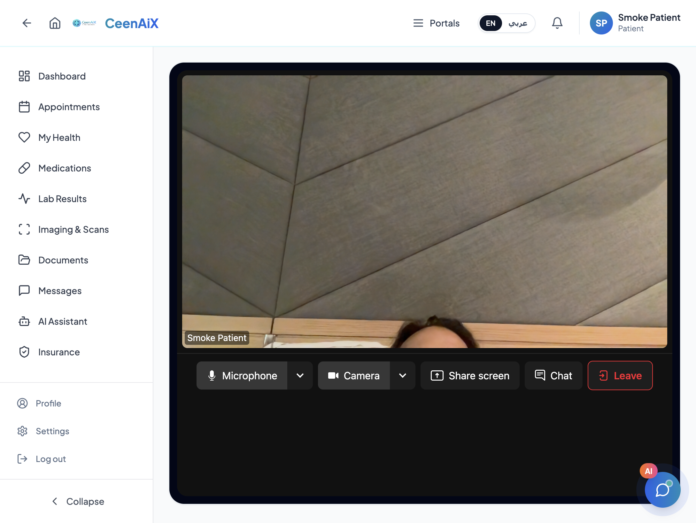
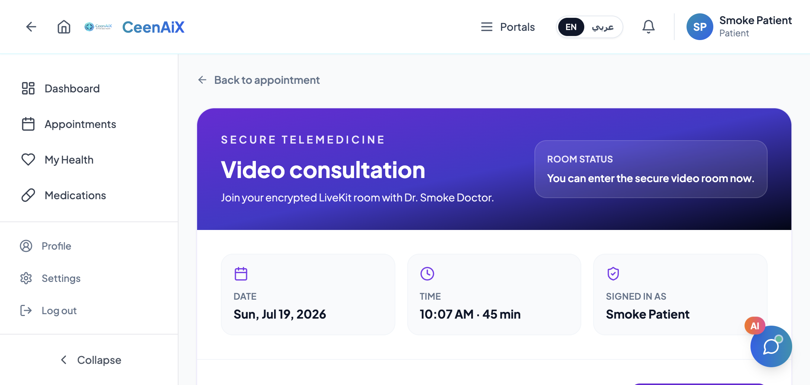
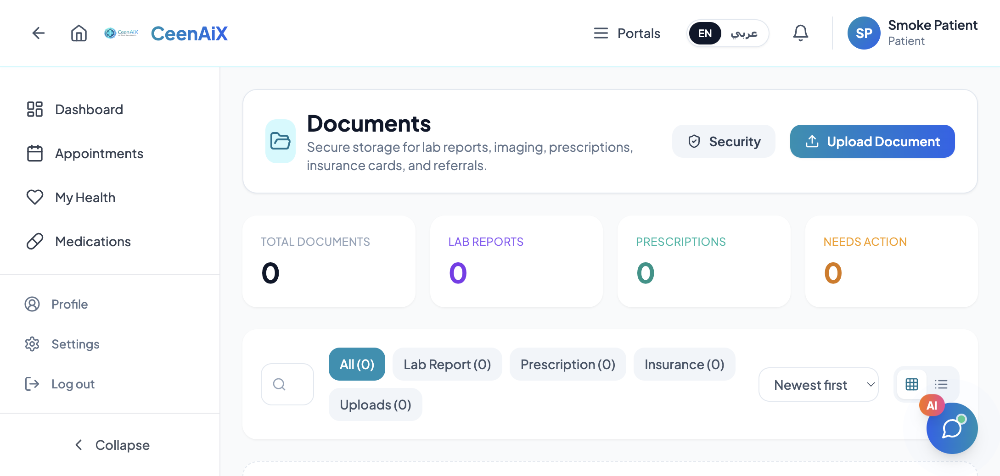
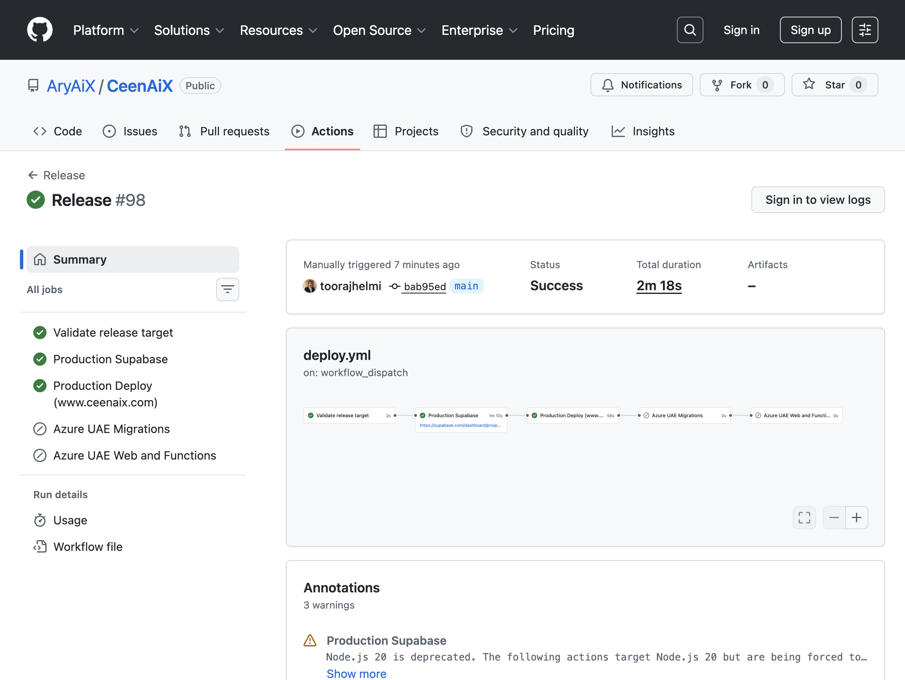

# Weekly Report — Product Readiness, LiveKit Telemedicine & Prod Release Unblock

Date: 2026-07-19  
Project: CeenAiX  
Scope: Cross-role product readiness (insurance, imaging, appointments, documents, admin), LiveKit telemedicine, hosted smoke runner, Edge Function production deploy fix  
Branches / PRs: **#103** product readiness + telemedicine · **#104** hosted smoke · **#105** Edge Function bundling fix → `main` (`bab95ed`)  
Prior report: [Weekly Report — Responsiveness Audit & Mobile/Tablet Portal Hardening (2026-07-05)](weekly-report-2026-07-05-responsive-audit.md)

## Executive Summary

| Metric | This week | Prior report (2026-07-05) |
|--------|-----------|----------------------------|
| **Headline achievement** | **LiveKit telemedicine live on prod; Release unblocked; DEV + PROD hosted smoke green** | Responsive audit and portal hardening merged in PR #90 |
| **PRs merged** | 3 (`#103`, `#104`, `#105`) | 1 (`#90`) |
| **Primary product ship** | Telemedicine rooms, imaging lifecycle, document vault, insurance decisions, admin lifecycle, auth/RLS hardening | Shared portal shells and mobile/tablet overflow fixes |
| **Ops / delivery** | Hosted smoke runner; esm.sh → `npm:` Edge imports + deploy retries; Release #98 success | Lint/typecheck/build CI on responsive PR |
| **Validation evidence** | `npm run smoke:dev` and `smoke:prod` passed (7 roles + LiveKit join/leave) | Playwright responsive specs + CI build |

This week closed the product-readiness pass and took telemedicine to production. PR **#103** shipped LiveKit-backed patient/doctor video visits with a `telemedicine-token` Edge Function, plus imaging, document vault, insurance decisioning, and admin lifecycle work. PR **#104** added a reusable post-deploy browser smoke runner. PR **#105** fixed a production Release failure caused by flaky `esm.sh` bundling during Edge Function deploys.

After Release **#98**, hosted smoke against `https://www.ceenaix.com` passed for all seven portal roles and LiveKit join/leave.

## Screenshots (prod)

### Live telemedicine session



Patient portal on `www.ceenaix.com`: active LiveKit room with camera feed, microphone/camera/share/chat controls, and Leave.

### Telemedicine join lobby



Join window open for the smoke virtual appointment with Dr. Smoke Doctor.

### Patient document vault



Canonical document vault UI (lab reports, prescriptions, insurance, uploads).

### Production Release fix



Release #98 succeeded: Production Supabase + Production Deploy (`www.ceenaix.com`).

## Shipped this week

### PR #103 — Complete product readiness workflows

- LiveKit telemedicine UI (`LiveKitConsultationRoom`, `LiveKitStage`) for patient and doctor routes.
- Supabase Edge Function `telemedicine-token` with join-window helpers in `src/lib/telemedicine.ts`.
- Imaging lifecycle unification, patient appointment detail, document vault, insurance pre-auth/claims decisioning, admin user/insurance CRUD.
- Auth/RLS hardening for role assignment and lab visibility.
- LiveKit secrets and function deploy to dev (`lgfaucsfiyxvmsghnpey`) and prod (`ziykaxyadcdmyakzvjff`).

### PR #104 — Hosted smoke test runner

- `npm run smoke:hosted`, `smoke:dev`, `smoke:prod` via `scripts/hosted-smoke.mjs`.
- Covers patient, doctor, insurance, lab, pharmacy, admin, clinic login + primary safe routes.
- Optional LiveKit join/leave via `SMOKE_TELEMEDICINE_APPOINTMENT_ID`.
- Runbook: `docs/runbooks/hosted-smoke-tests.md`.

### PR #105 — Fix Edge Function prod deploy bundling

- Replaced `https://esm.sh/...` imports with `npm:@supabase/supabase-js@2.49.8` and `npm:livekit-server-sdk@2.17.0` across Edge Functions.
- Added retries in `scripts/deploy-edge-functions.mjs` for transient bundler failures.
- Unblocked Release failure on `clinic-doctor-invite` (esm.sh HTTP 522).

## CI / Platform Delivery

| Change | Evidence | Detail |
|--------|----------|--------|
| Product readiness + telemedicine | [PR #103](https://github.com/AryAiX/CeenAiX/pull/103) | Merged 2026-07-19 |
| Hosted smoke runner | [PR #104](https://github.com/AryAiX/CeenAiX/pull/104) | Merged 2026-07-19 |
| Edge Function bundling fix | [PR #105](https://github.com/AryAiX/CeenAiX/pull/105) | Merged 2026-07-19 · commit `bab95ed` |
| Failed Release (pre-fix) | [run 29695564289](https://github.com/AryAiX/CeenAiX/actions/runs/29695564289) | esm.sh 522 during Edge deploy |
| Successful Release #98 | [run 29695945939](https://github.com/AryAiX/CeenAiX/actions/runs/29695945939) | Production Supabase + www.ceenaix.com |

## Verification

```text
Hosted smoke — DEV (https://dev.ceenaix.com)
passed — patient, doctor, insurance, lab, pharmacy, admin, clinic
passed — telemedicine patient/doctor join + leave

Hosted smoke — PROD (https://www.ceenaix.com)
passed — patient, doctor, insurance, lab, pharmacy, admin, clinic
passed — telemedicine patient/doctor join + leave
note — one ignored transient "Failed to fetch" on insurance session refresh

Local / CI (as documented on PRs)
passed — lint, typecheck, unit tests, build (PR #103 follow-up for @types/dom-mediacapture-record)
passed — local prod deploy of clinic-doctor-invite after npm: import switch
```

## Residual Notes

- **Prod vs DEV schema drift:** some portal profile columns present on DEV are absent on PROD (e.g. `insurance_payer_profiles.contact_email`). Synthetic seed scripts must stay schema-aware.
- **Node 20 deprecation warnings** on Release Actions jobs — plan runner upgrade.
- **Hosted smoke accounts** (`smoke.*@ceenaix.test`) remain in PROD for verification; rotate or remove when no longer needed.
- **Camera/microphone** in automated browser capture depends on host device permissions; smoke join/leave still validates token + room lifecycle.
